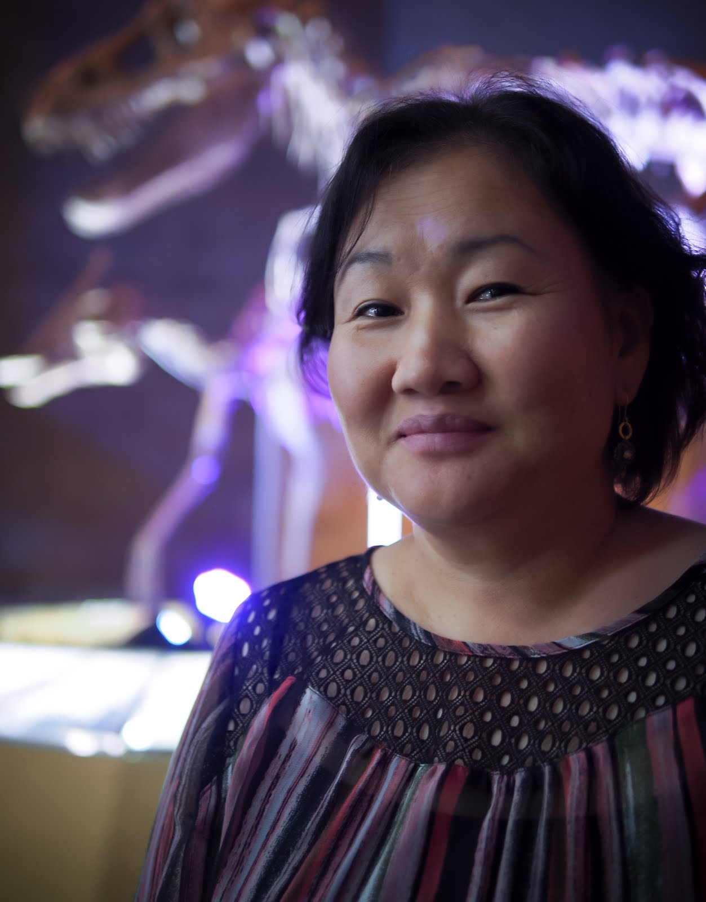

On a rainy Friday afternoon, Bolortsetseg Minjin and I met at the Lenwich on 75th and Columbus. I found her amidst the late lunch crowd, a petite woman wearing a hoodie printed with the image of a T. rex skeleton. "Too loud?" she asked above the din. "All good," I said. We sat near the door, where we'd spend the next hour jockeying for booth space with a mix of museum-goers and locals.

I first met Bolortsetseg—who goes by Bolor—through a mentorship program at the American Museum of Natural History (AMNH); with three other museum staff, we'd schedule monthly lunches with the idea that mentor and mentee roles were fluid, and that all stood to gain, regardless of seniority (though, as the single non-PhD in the group, I received far more than I doled out). I was drawn to Bolor immediately—to her warmth and the unassuming openness with which she detailed her life's incredible work. There are few female Mongolian natural scientists, and even fewer female Mongolian paleontologists, despite the richness of Mongolia's fossil deposits. (The Gobi desert in particular has been the source of landmark discoveries over the decades, including the famous 'two fighting dinosaurs,' the intertwined skeletons of a velociraptor and protoceratops.)

Though Bolor's father was a paleontologist, she didn't visit the Gobi until her undergraduate years as a geology major. "I had a high school teacher who took a few of his students to the desert each year," she told me. But he refused to take Bolor. "He said, 'Just go with your father.' But my mom refused to let me go." When it came time for her to choose her major at the Mongolian University of Science and Technology, she chose a discipline that would require frequent sojourns to the desert. Many college-bound teens, exhilarated by the prospect of lack of parental oversight, dream of cities; Bolor made a beeline for the desolate Gobi.

Despite this, her initial encounter with the desert environment wasn't as promising as she'd hoped. "I thought the desert was all dunes," she said. What she found was a stark landscape of scrubby brush and rocky soil. Instead of dunes, she found badlands—and lots of lizards. "I was so scared by those lizards," she laughed, and told me that she'd made a mad dash to the car she'd come in upon seeing so many skittering across the desert floor.

~

Before the AMNH and impromptu meetings in Lenwich, before the Gobi and lizards, there was a young girl who found herself naturally drawn to science. As the youngest of three siblings, Bolor learned to keep up with two older brothers and, in school, found herself more comfortable in the company of male students, who received more science-related education than did their female counterparts.

In the course of our conversation, Bolor described childhood in a Mongolia both rooted in its Soviet past and striving toward greater openness; her father's generation, she told me, was the last in a line of generations raised entirely within the Soviet model of education and research. She sometimes found herself at odds with her father and the Soviet system. While her father wrote his academic texts in Russian and felt no great need to communicate his findings to the public, Bolor felt that engagement with younger students and lay audiences was crucial. "The Soviet model was not good at training the next generation," said Bolor. "In the classroom, it was 'you listen, I talk.'" Years later, on trips to Mongolian elementary schools, Bolor would note that students were hesitant to speak up when asked to engage in open conversation in the classroom.

We took a detour into a discussion about many East Asian countries' culture of social reserve, which doesn't lend itself to the kind of freewheeling dialogue Bolor wanted to see in classrooms—speak out too much, and a person (a woman, especially) might be accused of shameless showboating. Bolor noted that, though a majority of the college-educated population in Mongolia is female, departmental leadership is still overwhelmingly male. In this academic and cultural climate, Bolor learned to advocate for herself and her work. Switching here to mentor-mode, she advised me to speak to people as equals, regardless of their credentials (or lack thereof—"I never use that voice with babies," she said, then mimicked high-pitched, nonsensical baby talk).

It was clear from her early experiences on expeditions that women scientists faced a bevy of challenges in addition to those presented by the desert environment. On a different college trip to the Gobi, Bolor was pursued around the expedition's base camp by an inebriated local man; she hid from him until the rest of the team returned. Later, after she'd already earned her masters degree and had been invited on her first paleontological expedition (her trips to the desert in college had been for geo-mapping), she discovered that, as the sole female member of the party, she was expected to cook.

She flatly refused, and went on a dig with the rest of the team. There, she discovered a flare for fossil-hunting. Fossils are deposited in layers of earth; finding such a layer is akin to locating a seam of some precious metal. Bolor's first find was the skull of some small animal, a lizard or mammal. Most fossils are unassuming lumps of rock before they're cleaned, so a discerning eye is required to spot these proverbial diamonds in the rough. It was the symmetry of her first find that struck her, she said—the arrangement of the jaw around the tiny skull.

After her initial success, she "followed the layer," inspecting the same horizontal stripe of earth and turning up more fragments of bone. Though the megafauna among prehistoric beasts—T. rex et al—are most well-known to the public, Bolor's favorite fossils are the skeletons of smaller animals. "The teeth and claws are so perfect, so cute," she laughed.

Her early success led to invitations to other expeditions and, eventually, a doctoral degree at the AMNH. Once in New York, she never forgot her Mongolian roots, arranging for a 'mobile museum' on paleontological research to be shipped back to Mongolia. The outsize bus, donated by AMNH, contains casts of fossils to show-and-tell to rural schoolchildren—despite their proximity to the sources of the originals, many of these children never learn about Mongolia's fossil record. In farming towns of some 2,000 residents, formal education often ends at the ninth grade; each grade consists of one class of about 30 students, many of whom take extended breaks in the spring and fall to help tend to their families' livestock during birthing season, or to plant and harvest crops.

Bolor realized that it was these outreach initiatives that were the most fulfilling for her. Research could become monotonous (a person tires of looking at and labeling femurs—her words, not mine), but she never tired of speaking to students. In academia, a certain amount of stigma is associated with teaching, which is time that could otherwise be applied to research; Bolor, with her customary good nature, flouted this convention and threw herself into educating young Mongolians through such initiatives as the [Institute for the Study of Mongolian Dinosaurs](https://mongoliandinosaurs.org/), which she founded and currently runs.

Bolor told me all this over her lunch, a bowl of quinoa and arugula, as small children slid in and out of the booth beside her ("that's alright, sweetie," she reassured a boy who bumped into her on his way out of his seat) and adults cast half-interested glances at the younger Asian woman who appeared to be engrossed in whatever the older Asian woman was saying. A person as busy as Bolor could get away with a certain degree of aloofness, but she was grounded and approachable without fail.

She worried about her eight-year-old daughter, an only child who seemed to have inherited her mother's fascination with science but also found that her female friends weren't as interested in science as her male friends. It felt like déjà vu, even post- a generation's progress in STEM education.

We stood to leave, and Bolor expressed her dismay at Lenwich's lack of a compost bin. It was still drizzling as we walked back to the museum, both of us attempting to shelter beneath my umbrella. By the time we parted ways, at the entrance to the Department of Vertebrate Paleontology, Bolor—ever the good mentor—had thought of other ways to help. "I'll think of some other scientists you should talk to," she told me, and gave me a hug. I returned to Invertebrate Zoology and its tarantula tanks, feeling lighter and buoyed to continue my own work.

*Note: Unfortunately, I wasn't able to cover Bolor's work with [fossil repatriation](https://www.theatlantic.com/science/archive/2017/12/second-life-of-mongolian-fossils/548558/), [list of accolades](https://www.eurekalert.org/pub_releases/2013-07/sovp-sov072613.php), or [upcoming expedition to Mongolia](https://www.nationalgeographic.com/expeditions/experts/bolor-minjin/)!*
